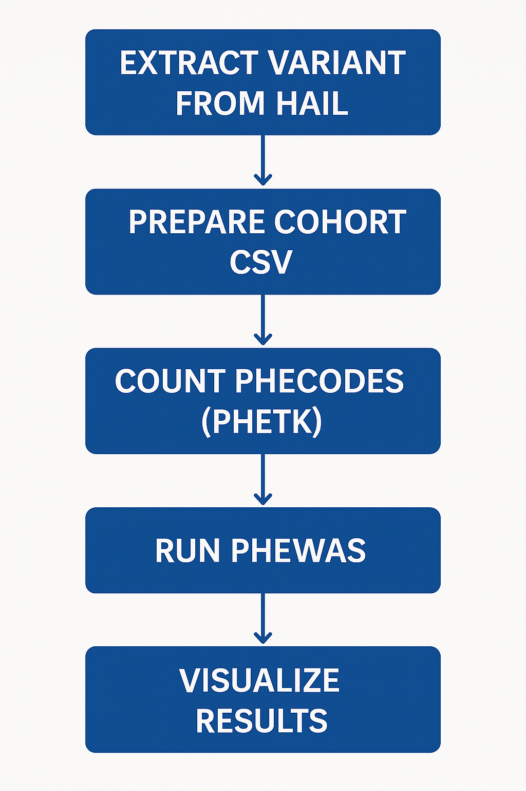

# PheWAS Pipeline with Hail Variant Extraction (All of Us Data)

This repository contains a workflow for conducting **Phenome-Wide Association Studies (PheWAS)** using genetic variant data from the **All of Us Research Program**, with variant extraction performed from a Hail MatrixTable. The workflow is structured in three primary parts:

1. **Variant Extraction from Hail Matrix Table**
2. **PheWAS Analysis using the [PheTK](https://github.com/nhgritctran/PheTK) package**
3. **(Optional) Running PheWAS in Batch Mode via `dsub`**

This project is ideal for researchers working on genotype-phenotype association studies within large-scale biobank data, such as _All of Us_.

---

## Project Overview

This workflow supports:
- Extraction of specific genetic variants (e.g., SNPs) using Hail from All of Us' MatrixTable
- Merging variants with phenotype and covariate data
- Running PheWAS using the [PheTK](https://github.com/nhgritctran/PheTK) package
- Visualizing results in Manhattan-style plots
- Running batch jobs on Google Cloud with `dsub`

---

## Pipeline Structure

<p align="center">
  
</p>

---

## Requirements

- Python 3.8+
- Jupyter Notebook
- [Hail](https://hail.is/) 0.2+
- [PheTK](https://github.com/nhgritctran/PheTK)
- pandas, numpy, matplotlib

Install PheTK via pip:

```bash
pip install PheTK --upgrade
```

or Jupyter Notebook (restart kernel after installation and prior to importing):
```
!pip install PheTK --upgrade
```

To check current installed version:
```
pip show PheTK | grep Version
```

---

## Usage Instructions

### 1. Variant Extraction (Hail)

```python
variant_extraction(
    var_pos='chr17:7579472',
    ref_allele='C',
    alt_allele='T',
    dbsnp_id='rs78378222',
    output_filename='TP53_variant'
)
```

This step exports a `.tsv` file with the extracted variant data, ready for merging.

---

### 2. PheWAS Analysis (PheTK)
More information on how to use the PheTK package is on their github repository (https://github.com/nhgritctran/PheTK/). 
The illustration here is only our we implement the modules in the package in our analyses.

#### Jupyter Notebook example for _All of Us_ Researcher Workbench:
##### add_covariates
This function better explained in the PheTK github repository adds covariate data to our cohort of interest and generate a new cohort csv file with covariate data included as output.

```python
# instantiate class Cohort object for _All of Us_ database version 8
cohort = Cohort(platform="aou", aou_db_version=8)

# Add covariates
cohort.add_covariates(
    cohort_csv_path="TP53_variant.csv",
    age_at_last_event=True,
    sex_at_birth=True,
    genetic_ancestry=True,
    first_n_pcs=10,
    output_file_name="cohort_with_covariates.csv"
)
```

##### Phecode module
Phecode module is used to retrieve ICD code data of participants, map ICD codes to phecode 1.2 or phecodeX 1.0, and aggregate the counts for each phecode of each participant. **Below is how we implemented the module in our analyses mostly done in the _All of Us_ Research Workbench and on other platforms**

###### Jupyter Notebook example on _All of Us_:
```
from PheTK.Phecode import Phecode

phecode = Phecode(platform="aou")
phecode.count_phecode(
    phecode_version="X", 
    icd_version="US",
    phecode_map_file_path=None, 
    output_file_name="my_phecode_counts.csv"
)
```

###### Jupyter Notebook example on other platforms:
```
from PheTK.Phecode import Phecode

phecode = Phecode(platform="custom", icd_df_path="/path/to/my_icd_data.csv")
phecode.count_phecode(
    phecode_version="X", 
    icd_version="US", 
    phecode_map_file_path=None,
    output_file_name="my_phecode_counts.csv"
)
```

##### PheWAS module
Check the [PheTK](https://github.com/nhgritctran/PheTK) package repository for more information on how to use the PheWAS module.

```
# Run PheWAS
phewas = PheWAS(
    phecode_version="X",
    phecode_count_csv_path="filtered_phecode_counts.csv",
    cohort_csv_path="cohort_with_covariates.csv",
    covariate_cols=["age_at_last_event", "sex_at_birth", "pc0", "pc1", ..., "pc9"],
    independent_variable_of_interest="case",
    output_file_name="phewas_results.csv"
)
phewas.run()
```

---

## Batch PheWAS using `dsub`

The `dsub` pipeline is especially useful when running **multiple PheWAS analyses** in batch (e.g., across tens/hundreds of SNPs).

```python
MACHINE_TYPE = "c4-standard-8"
SCRIPT_PATH = "gs://your-bucket/scripts/run_phewas.sh"  # Update with your script path

env_vars = {
    "SNP_ID": "rs78378222",
    "SEX_COL": "sex_at_birth",
    "COVARIATES": "age_at_last_event,sex_at_birth,pc0,pc1,pc2,pc3,..."
}

input_params = {}

output_params = {
    "PHEWAS_RESULTS": "gs://your-bucket/phewas_results.csv"
}

dsub_script(
    machine_type=MACHINE_TYPE,
    envs=env_vars,
    in_params=input_params,
    out_params=output_params,
    image="phetk/phetk:0.1.47",
    script="gs://your-bucket/scripts/run_phewas.sh"
)
```

Your script (`run_phewas.sh`) might look like:

```bash
#!/bin/bash

python3 - <<EOF
from PheTK.PheWAS import PheWAS

phewas = PheWAS(
    phecode_version="X",
    phecode_count_csv_path="\${PHECODE_COUNTS}",
    cohort_csv_path="\${COHORT}",
    sex_at_birth_col="\${SEX_COL}",
    covariate_cols="\${COVARIATES}".split(","),
    independent_variable_of_interest="case",
    output_file_name="\${PHEWAS_RESULTS}"
)
phewas.run()
EOF
```

---

## Input Files

- `hail.mt`: MatrixTable from All of Us
- `variant_file.tsv`: Extracted from Hail
- `phecode_counts.csv`: Phecode counts file (generated via PheTK)
- `cohort_with_covariates.csv`: Merged cohort, genotype + covariates

---

## Output Files

- `phewas_results.csv`: Results from PheWAS
- `*.png`: Optional plots (e.g., Manhattan)

---

## Acknowledgments

- **The [_All of Us_ Research Program](https://allofus.nih.gov/)**
- **[PheTK: The Phenotype Toolkit](https://github.com/nhgritctran/PheTK)** by nhgritctran
